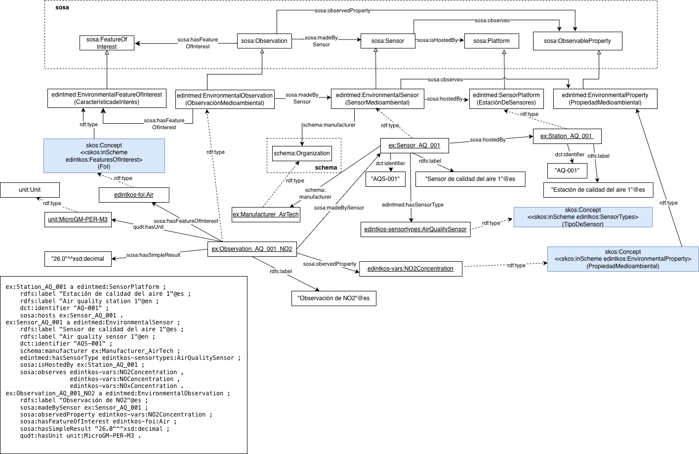

# Ontología EDINT de Sensores Medioambientales, caso Calidad del Aire (EDINT Environmental Sensors Ontology)

Este repositorio reutiliza el patrón general definido en la [Ontología de Medioambiente](https://github.com/EDINT-Ontologia/edint-ontologia-medio-ambiente/tree/a09f6a58ac148cebdec8d7ac49f0ba707cbda6ac) para representar estaciones, sensores y observaciones medioambientales. En dicha ontología, se adopta una modelización común basada en una plataforma de sensores (`SensorPlatform`), sensores medioambientales (`EnvironmentalSensor`) y observaciones medioambientales (`EnvironmentalObservation`).

En este caso, dicho patrón se aplica específicamente al dominio de la calidad del aire. Para ello, la especialización no se realiza a través de vocabularios controlados SKOS que permiten clasificar y restringir semánticamente los elementos del modelo.

En particular:

- el tipo de sensor se expresa mediante la propiedad `edintmed:hasSensorType`, cuyos valores son conceptos SKOS pertenecientes al esquema `SensorTypes`. Para el caso de calidad del aire, los sensores se clasifican mediante el concepto `AirQualitySensor`;
- las propiedades observadas se representan mediante conceptos del esquema `SensorVariables`, por ejemplo `NO2Concentration`, `O3Concentration` o `PM10Concentration`;
- la característica de interés observada se representa mediante conceptos del esquema `FeaturesOfInterest`, como por ejemplo `Air` o `ParticulateMatter`.

Este enfoque permite reutilizar una misma estructura ontológica para distintos dominios medioambientales, manteniendo la especialización del caso de calidad del aire a través de los KOS y facilitando además la definición de reglas de consistencia y validación.

En la carpeta [`./examples`](./examples) se incluye una serie de ejemplos que muestran cómo utilizar la Ontología de Medioambiente junto con los vocabularios SKOS para la especialización en calidad del aire. Estos ejemplos ilustran la descripción de estaciones, sensores de calidad del aire, propiedades observadas y observaciones asociadas.

# Estructura del repositorio (Repository structure)

| Folder              | Description                                                                                             |
| ------------------- | ------------------------------------------------------------------------------------------------------------------------ |
| **examples/** | Incluye ejemplos que demuestran cómo instanciar o aplicar la ontología en escenarios de datos reales. |
| **diagrams/**   | Contiene el diagrama con instancias relacionadas a los conceptos de la Ontología de Sensores Medioambientales. |
| **mappings/**   | Incluye mappings RML que ejemplifican la transformación de orígenes de datos en datos enlazados. |

# Diagrama con ejemplo de Calidad del Aire (Diagram with an Air Quality Example)
## Ejemplo de utilización de la Ontología de Sensores Medioambientales para Calidad del Aire 

# Mantenimiento y evolución (Maintenance and evolution)

Para manejar las incidencias o mejoras sugeridas con respecto a la ontología, recomendamos seguir las guías proporcionadas en ([Issues Management](./ISSUES.md)) para generar una incidencia.

# Financiación (Funding)

Esta ontología ha sido desarrollada en el contexto del Espacio de Datos para las Infraestructuras Urbanas Inteligentes ([EDINT](https://edint.es/)).

